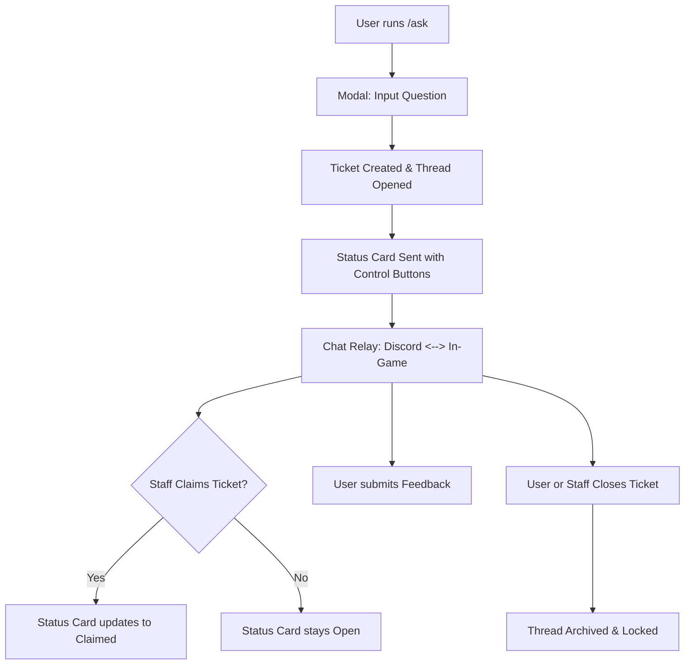

# MCLabs Discord Bot

An interactive Discord bot integrated with a FastAPI web service, custom RAG (Retrieval-Augmented Generation) backend, MongoDB database, and the MCLabs Minecraft server. It provides server utility commands and hosts a real-time, cross-platform ticket support system.

---

## 🎮 User Features & Commands

### General Commands
Any Discord member can use these hybrid slash commands to retrieve server information:
*   **`/info`**: Displays general information about the MCLabs server, including the server IP, Minecraft client version, and core gameplay features (e.g., Chemistry/Selling, Companies, Towns, and Leaderboards).
*   **`/ip`**: Shows the Minecraft server IP (`play.labs-mc.com`) in a clean embed.
*   **`/version`**: Displays the supported Minecraft game version (`1.21.11`).

### Help Ticket System
The core feature of the bot is the cross-platform **Help Ticket System**. This system enables players to ask questions via Discord and receive automated RAG wiki replies, staff assistance, and in-game message relaying.

#### **The Ticket Workflow**
1.  **Ticket Creation (`/ask`)**: A user invokes `/ask` (optionally specifying a `question` argument to pre-populate the field). A popup modal titled **"Ask a Question"** appears.
2.  **Thread Setup**: Upon submitting, the bot responds ephemerally. A dedicated public thread named `🎫-ticket-[ID]` is created in the server's configured ticket channel.
3.  **Status Card**: At the top of the thread, the bot posts a persistent status card embed displaying:
    *   **Ticket Creator**: Mentions the user and lists their username.
    *   **Minecraft Account**: Shows the player's linked Minecraft username, or `Not Linked`.
    *   **Status**: Displays the live status (`🟢 Open`, `🟡 Claimed by <Staff>`, `🔴 Closed`).
    *   **Feedback**: Displays user feedback rating once submitted.
    *   **Original Question**: Displays the text entered in the modal.
4.  **Cross-Platform Conversation**: Users and staff can discuss the issue directly inside the thread. If the player is online in-game on the Minecraft server, messages sent in the Discord thread are relayed to their game client. Messages sent by the player in-game are relayed back into the Discord thread prefixed with `[In-Game] Username`.

#### **Ticket Thread Controls (Buttons)**
The bottom of the status card embed contains interactive buttons:
*   **🙋‍♂️ Claim**: Restricted to Staff (`Helper+`). Claims the ticket, updates the status card embed to gold, and posts a notification thread message.
*   **🚫 Unclaim**: Restricted to Staff (`Helper+`). Reverts the ticket status to `🟢 Open` so other staff members can assist.
*   **⭐ Feedback**: Restricted to the ticket creator. Prompts the user with a rating view (`Helpful 👍` or `Unhelpful 👎`). Selecting an option updates the status card's feedback field.
*   **🔒 Close**: Can be triggered by the ticket creator or a staff member. It opens a confirmation prompt (`Confirm Close` / `Cancel`). When confirmed:
    *   The ticket status updates to `🔴 Closed`.
    *   The Discord thread is archived and locked.
    *   The backend database is notified to mark the ticket closed.

---

## 🛠 Developer Information

### Architecture Overview
The bot is built on **discord.py** and runs alongside a **FastAPI** web application inside a single process, utilizing Python's `asyncio` loop. It acts as both a Discord client listening to user inputs and an API server listening to incoming hooks from the backend game server/RAG service.

### Environment Variables
The following environment variables are required and validated during the bot startup:
*   `DISCORD_BOT_TOKEN`: The authentication token for the Discord bot client.
*   `DISCORD_TICKET_CHANNEL_ID`: Channel ID (int) where the ticket threads will be created.
*   `DISCORD_ADMIN_CHANNEL_ID`: Channel ID (int) where startup, shutdown, and error alerts are sent.
*   `API_TOKEN`: Secret token used to authenticate outgoing and incoming API headers.
*   `RAILWAY_API_DOMAIN`: The domain address of the backend RAG/Wiki API service.
*   `USER_AGENT_DISCORDBOT`: The user agent string sent with requests to the backend.

### API Endpoints
The FastAPI router exposes endpoints mapped to `/` for the backend to notify the bot:

| Method | Endpoint | Description | Rate Limit |
| :--- | :--- | :--- | :--- |
| `POST` | `/wakeup` | Pings the bot's API server to ensure it is awake on Railway. | 50/min |
| `POST` | `/update` | Processes tickets relay actions (`CREATE`, `CLAIM`, `UNCLAIM`, `CLOSE`, `NEWMESSAGE`, `FEEDBACK`). Updates the Discord thread status card and relays chat. | 100/min |
| `POST` | `/send_admin_message` | Sends a message directly to the admin alerts channel (used by backend for reporting issues). | 30/min |

### Key Code Mechanisms

#### **1. Rolling Restarts & Active Session Tracking**
To handle rolling updates/restarts on Railway gracefully, each system (Discord bot and backend API) generates a unique session UUID on startup and registers it via the MongoDB helper in the `system_status` collection (under `_id: "discord"` or `_id: "backend"`).
When shutting down, the system checks if its session is still the active one: if another session has overtaken it, the shutting-down instance suppresses its shutdown notifications, preventing duplicate or confusing alerts.

#### **2. Persistent UI Views**
The buttons in the ticket thread are backed by `HelpTicketThreadView`, which overrides `timeout=None` and defines unique `custom_id` fields (e.g., `btn_claim_ticket`, `btn_close_ticket`). It is registered globally in `setup_hook` via `self.add_view(HelpTicketThreadView())` so that interactions continue to function even after a bot restart.

#### **3. API Wakeup Routine**
In `bot.ensureApiAwake`, the bot performs a POST request to the backend `/wakeup` with exponential backoff on startup. This prevents failures during initial communication with a sleeping backend server.
