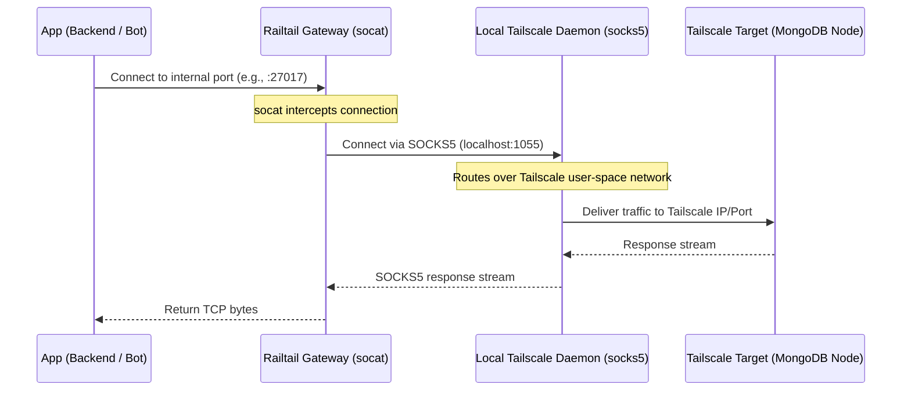

# Railtail: Tailscale Network Gateway for Railway

`railtail` is a lightweight gateway service designed to bridge Railway's internal private networking with a Tailscale tailnet. 

By running Tailscale in userspace-networking mode alongside a TCP forwarder (`socat`), it allows your other Railway services (e.g. backend api, discord bots, celery workers) to communicate with Tailscale nodes using standard, unproxied TCP traffic over Railway's internal private network.

---

## Architecture Overview

### Why this is better than sideloading:
- **No Python Monkeypatching:** Avoids breaking async event loops, SSL libraries, and IPv6 lookups.
- **Single Point of Configuration:** Only one service needs Tailscale binaries, auth keys, and state files.
- **Resource Efficient:** Runs a single tiny container using minimal CPU and RAM (Alpine Linux + socat).

---

## Configuration

`railtail` is configured entirely via environment variables.

| Variable Name | Description | Example |
| :--- | :--- | :--- |
| `TAILSCALE_AUTHKEY` | **Required** (or `TS_AUTHKEY`). Tailscale auth key/device token. | `tskey-auth-...` |
| `PROXY_MAPPINGS` | **Required**. Comma-separated list of mapping definitions formatted as `local_port:target_host:target_port`. | `27017:100.115.92.19:27017,8080:dedi-host:8080` |
| `TAILSCALE_HOSTNAME` | Optional. Hostname for this node on your Tailnet. | `railway-mongo-gateway` |

---

## How It Works Under the Hood

### 1. Tailscale in Userspace Mode
Because Railway container environments do not expose a TUN device (`/dev/net/tun`), Tailscale runs with `--tun=userspace-networking`. In this mode, it opens a SOCKS5 proxy server locally on `localhost:1055`.

### 2. Multi-port `socat` Port Forwarding
The gateway parses the `PROXY_MAPPINGS` variable. For each defined mapping:
- It launches a background `socat` listener on the specified `local_port`.
- When an incoming connection is received, `socat` negotiates with the local SOCKS5 proxy to route traffic to the target host and port over the Tailnet.

### 3. Active Process Monitoring
The `start.sh` script monitors the PIDs of `tailscaled` and all `socat` forwarders. If any process crashes or exits, the script exits immediately with status `1`, causing the Railway container to restart automatically.
