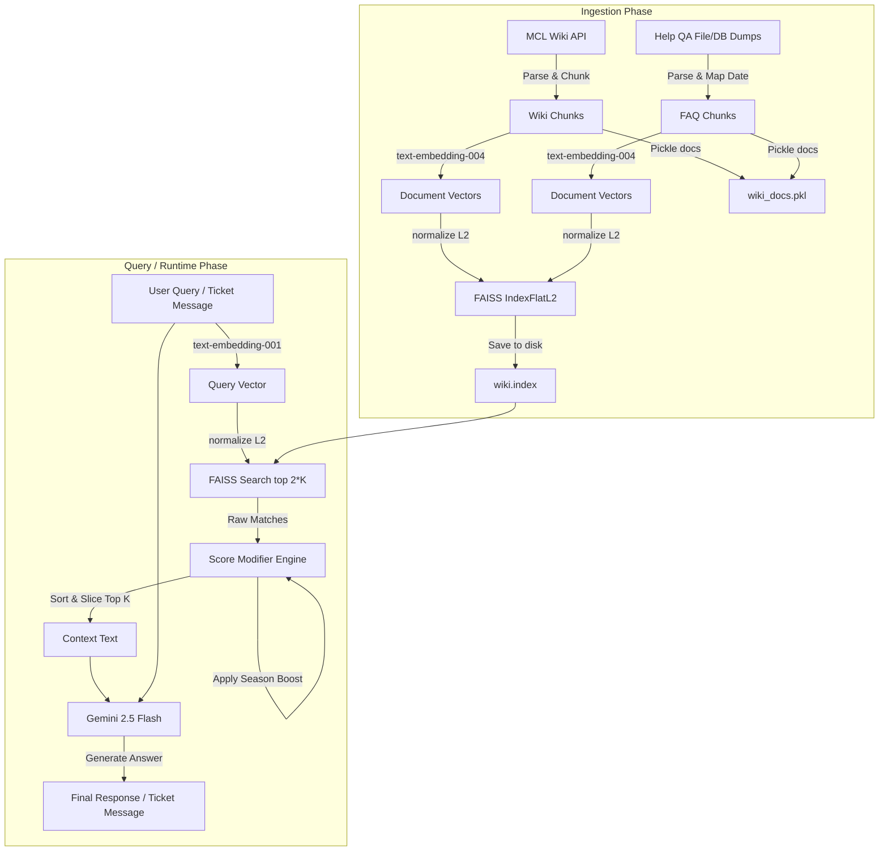

# MCLabs Wiki RAG System Documentation

Welcome to the technical documentation for the MCLabs Retrieval-Augmented Generation (RAG) system. This document explains the architecture, components, similarity modifiers, and prompt guidelines that power automated wiki queries and discord/in-game ticket answering.

---

## Table of Contents
1. [System Architecture](#1-system-architecture)
2. [Data Ingestion & Indexing (`MCL_WikiEmbedder`)](#2-data-ingestion--indexing-mcl_wikiembedder)
   - [Wiki Article Ingestion](#wiki-article-ingestion)
   - [Support FAQ Ingestion](#support-faq-ingestion)
   - [Embedding and Vector Index Storage](#embedding-and-vector-index-storage)
3. [Retrieval & Scoring Modifiers (`MCL_WikiRag`)](#3-retrieval--scoring-modifiers-mcl_wikirag)
   - [Query Processing](#query-processing)
   - [FAQ Boost](#faq-boost)
   - [Recency Decay (Half-Life)](#recency-decay-half-life)
   - [Season Boost](#season-boost)
4. [Generation & Guardrails](#4-generation--guardrails)
   - [Standard Q&A Pipeline](#standard-qa-pipeline)
   - [Support Ticket Classification ("UNANSWERABLE")](#support-ticket-classification-unanswerable)
5. [Configuration & Environment Variables](#5-configuration--environment-variables)

---

## 1. System Architecture

The system utilizes a dual-pipeline approach (Wiki Articles + Mongo Support FAQs) to index knowledge, retrieve relevant context, modify distance metrics using domain-specific heuristics, and generate replies using Gemini.



---

## 2. Data Ingestion & Indexing (`MCL_WikiEmbedder`)

Located in [`docfetch.py`](file:///Users/chrishinkson/Programming/Personal%20Projects/MCLabs/McLabsWikiGpt/src/rag/docfetch.py), the `MCL_WikiEmbedder` class is responsible for harvesting source text, transforming it into vector embeddings, and creating a FAISS flat index.

### Wiki Article Ingestion
- **Source**: MediaWiki Action API at `https://labs-mc.com/w/api.php`
- **Method**: Fetches titles using the `allpages` list with continuation support, then retrieves HTML content using the `parse` action.
- **Parsing**: `BeautifulSoup` strips out HTML markers to extract clean text.
- **Chunking**: Splits pages into sliding-window word blocks.
  - **Chunk Size**: 500 words
  - **Overlap**: 50 words (retains semantic context at boundaries)

### Support FAQ Ingestion
- **Source**: File logs or Mongo DB dumps format (`[Timestamp] time|||question|||answer`).
- **Parsing**: Extracts timestamps, questions, and answers. Timestamps are parsed and standardized into ISO 8601 Date format (`YYYY-MM-DD`).
- **Formatting**: Each QA pair is structured into a distinct chunk:
  ```
  T: <ISO-Date>
  Q: <Question>
  A: <Answer>
  ```

### Embedding and Vector Index Storage
- **Model**: `text-embedding-004` (via Google GenAI Client)
- **Task Type**: `RETRIEVAL_DOCUMENT`
- **Indexing**: 
  - Uses `faiss.IndexFlatL2(768)` for L2 Euclidean distance vector matching.
  - Normalizes the generated embeddings matrix using `faiss.normalize_L2` before adding to the index.
- **Persistence**: Saved to disk at startup/indexing run:
  - Vector index: `embeddings/wiki.index`
  - Document metadata list: `embeddings/wiki_docs.pkl` (retains titles, raw contents, sources, dates)

---

## 3. Retrieval & Scoring Modifiers (`MCL_WikiRag`)

Located in [`rag.py`](file:///Users/chrishinkson/Programming/Personal%20Projects/MCLabs/McLabsWikiGpt/src/rag/rag.py), the `MCL_WikiRag` class manages user queries, similarity searches, and distance/score modifications.

### Query Processing
- The query is embedded using `text-embedding-001` (Task type: `RETRIEVAL_QUERY`).
- The vector is normalized with `faiss.normalize_L2`.
- A similarity search retrieves the top `K * 2` nearest neighbors from the FAISS index to allow buffer room for score modifiers.

### FAQ Boost
Since direct player-facing Q&As are highly relevant to incoming support queries, chunks from the `helpQA` source receive a boost multiplier:
$$Score_{new} = Score_{raw} \times RAG\_HP\_FAQSCOREBOOST$$
*Default value: 1.2*

### Recency Decay (Half-Life)
Older help questions might contain outdated information (e.g. from previous map seasons). To counter this, help QA scores decay exponentially with document age:
$$Score_{new} = Score_{old} \times e^{-\lambda \cdot AgeDays}$$
Where $\lambda$ represents the decay constant defined by the half-life parameter:
$$\lambda = \frac{\ln(2)}{RAG\_HP\_RECENCYHALFLIFE}$$
*Default Recency Half-Life: 90 days*

### Season Boost
To prioritize support questions originating from the current map season, a season boost is applied to documents created on or after May 1st of the current calendar year:
$$Score_{new} = Score_{old} \times RAG\_HP\_SEASONBOOST$$
*Default value: 1.1*

After modifiers are applied, the documents are resorted in descending order of their modified score, and the top `K` chunks are selected.

---

## 4. Generation & Guardrails

The LLM generation pipeline leverages Google Gemini with detailed system rules and semantic translations specific to the server ecosystem.

### Standard Q&A Pipeline
Used for general queries (`queryPipeline`). Chunks are formatted as context, and sent with the user question to Gemini under the following guidelines:
- **Medium Length**: Concise but detailed response.
- **Strict Anti-Hallucination**: If the context is insufficient, Gemini is directed to answer strictly with *"I don't know"*.
- **Conflict Resolution**: If multiple context chunks conflict, the most recent chunk is preferred.
- **Terminology Translations**:
  - Never use the word "chemicals"; always refer to them as "chems".
  - Translate "Town world" to "Overworld".
  - Translate "Company world" to "Underworld".
  - Ignore any context regarding "factions", `/f` commands, or the "raid world".

### Support Ticket Classification ("UNANSWERABLE")
Used for automated ticket answering (`queryTicketPipeline`). It implements additional guardrails:
- **Greeting/Irrelevant Filter**: If the message is just a greeting (e.g., "hello"), statement, thank you, or contains no concrete request, the model returns exactly `UNANSWERABLE`.
- **Context Sufficiency**: If the context doesn't have enough facts to answer, the model must output `UNANSWERABLE`.
- If the model returns `UNANSWERABLE`, the Help Manager skips appending an automated response, letting staff handle the ticket.

---

## 5. Configuration & Environment Variables

The system relies on several parameters in the `.env` file to customize behavior:

| Variable | Description | Default |
|---|---|---|
| `GOOGLE_GEMINI_API_KEY` | Developer access token for Gemini APIs | (Required) |
| `GOOGLE_GEMINI_MODEL` | Gemini generative text model | `gemini-2.5-flash` |
| `RAG_HP_FAQSCOREBOOST` | Boost multiplier for help QA pairs | `1.2` |
| `RAG_HP_RECENCYHALFLIFE`| Decay half-life (in days) for FAQs | `90` |
| `RAG_HP_SEASONBOOST` | Boost multiplier for current-season FAQs | `1.1` |
