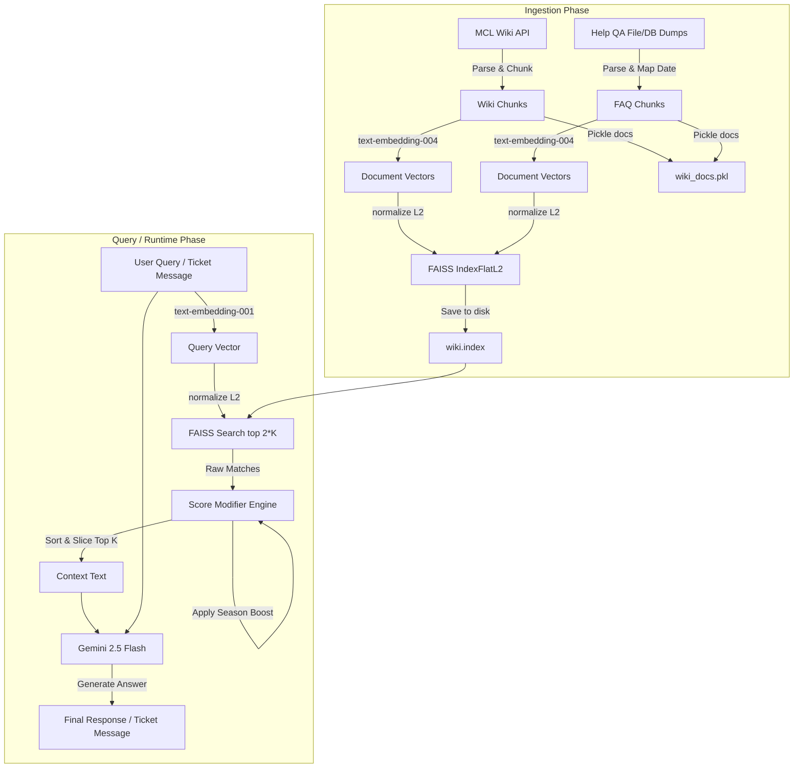

# MCLabs Wiki RAG System Documentation

Welcome to the technical documentation for the MCLabs Retrieval-Augmented Generation (RAG) system. This document explains the architecture, components, similarity modifiers, and prompt guidelines that power automated wiki queries and discord/in-game ticket answering.

---

## Table of Contents
1. [System Architecture](#1-system-architecture)
2. [Prework Stage: Data Ingestion & Indexing (`MCL_WikiEmbedder`)](#2-prework-stage-data-ingestion--indexing-mcl_wikiembedder)
   - [Wiki Article Ingestion](#wiki-article-ingestion)
   - [Support FAQ Ingestion](#support-faq-ingestion)
   - [Chunking Strategy](#chunking-strategy)
   - [Generating Vector Embeddings](#generating-vector-embeddings)
   - [Adding a New Data Type](#adding-a-new-data-type)
3. [Storage, Persistence & Runtime Loading (`MCL_WikiDocLoader`)](#3-storage-persistence--runtime-loading-mcl_wikidocloader)
   - [Persistence Files](#persistence-files)
   - [Runtime Load Flow](#runtime-load-flow)
4. [Retrieval & Scoring Modifiers (`MCL_WikiRag`)](#4-retrieval--scoring-modifiers-mcl_wikirag)
   - [Query Processing](#query-processing)
   - [FAQ Boost](#faq-boost)
   - [Recency Decay (Half-Life)](#recency-decay-half-life)
   - [Season Boost](#season-boost)
5. [Generation & Guardrails](#5-generation--guardrails)
   - [Standard Q&A Pipeline](#standard-qa-pipeline)
   - [Support Ticket Classification ("UNANSWERABLE")](#support-ticket-classification-unanswerable)
6. [Configuration & Environment Variables](#6-configuration--environment-variables)

---

## 1. System Architecture

The system utilizes a dual-pipeline approach (Wiki Articles + Mongo Support FAQs) to index knowledge, retrieve relevant context, modify distance metrics using domain-specific heuristics, and generate replies using Gemini.



---

## 2. Prework Stage: Data Ingestion & Indexing (`MCL_WikiEmbedder`)

The [MCL_WikiEmbedder](file:///Users/chrishinkson/Programming/Personal%20Projects/MCLabs/McLabsWikiGpt/src/rag/docfetch.py#L40) class is responsible for harvesting source text, transforming it into vector embeddings, and creating a FAISS flat index. It is designed to be executed periodically (e.g., via cron tasks, background updates, or developer command runs) and **must not be initialized or invoked during runtime RAG queries**.

### Wiki Article Ingestion
* **Source**: MediaWiki Action API at `https://labs-mc.com/w/api.php`.
* **API Flow**:
  1. Retrieves all page titles using `action=query` and `list=allpages` in batches of 10.
  2. Uses continuation queries with the `apcontinue` parameter to iterate through the entire wiki.
  3. Fetches the page markup for each title using `action=parse` and extracting the HTML block `response["parse"]["text"]["*"]`.
* **Parsing**: Cleans raw HTML using `BeautifulSoup` to strip tags and extract clear text.

### Support FAQ Ingestion
* **Source**: Raw text logs or Mongo database exports format (`[Timestamp] time|||question|||answer`).
* **Timestamp Normalization**: Standardizes timestamps by checking for a decimal point (which represents Unix epoch seconds) versus integer values (milliseconds) and standardizing them into ISO 8601 strings (`YYYY-MM-DD`).
* **Chunk Formatting**: Structures the question-answer pairs into a standardized template prefix:
  ```
  T: <ISO-Date>
  Q: <Question>
  A: <Answer>
  ```

### Chunking Strategy
* **Word-level sliding window**: The `_chunkWikiPage` method splits raw text into words by space and compiles sliding slices:
  * **Chunk Size**: 500 words
  * **Overlap**: 50 words (retains semantic context at page and paragraph boundaries)

### Generating Vector Embeddings
* **Embedding Model**: `text-embedding-004` (via the Google GenAI SDK client).
* **Batching**: Inputs are processed in batches (max 100 chunks per embedding request to respect API limitations).
* **Vector Index Configuration**:
  * Utilizes `faiss.IndexFlatL2(768)` for L2 Euclidean distance vector matching.
  - Normalizes the generated embeddings matrix using `faiss.normalize_L2` to ensure consistent cosine/Euclidean distance properties before adding to the index.

### Adding a New Data Type
To add a new data type (e.g., in-game command manuals, Discord announcements) to the prework stage, follow these steps:
1. **Define the Parser**: Write an ingestion method that retrieves raw strings from the source (file system, database, or API).
2. **Format and Structure**: Prefix the data chunks with structured identifiers (e.g. `Title: <X>\nContent: <Y>`) and extract metadata (date/time, title, source label).
3. **Chunk**: Apply the sliding window chunker helper `_chunkWikiPage` to split large contents into normalized sizes.
4. **Generate Embeddings**: Batch the list of chunks and call `embedChunks(chunks)` of `MCL_WikiEmbedder`.
5. **Normalize and Add to FAISS Index**:
   ```python
   embeddingsMatrix = np.vstack(embeddings).astype('float32')
   faiss.normalize_L2(embeddingsMatrix)
   self.index.add(embeddingsMatrix)
   ```
6. **Extend Documents Metadata**: Add matching dictionary elements to `self.documents`:
   ```python
   self.documents.extend([
       {
           "title": "Document Title", 
           "content": chunk_text, 
           "source": "new_source_name", 
           "date": "YYYY-MM-DD"
       }
   ])
   ```
7. **Write to Disk**: Run `saveIndexAndDocuments()` to overwrite the cached files in the `embeddings/` folder.

---

## 3. Storage, Persistence & Runtime Loading (`MCL_WikiDocLoader`)

To optimize production performance and ensure architectural decoupling, the RAG serving layer loads a pre-computed vector database from disk using [MCL_WikiDocLoader](file:///Users/chrishinkson/Programming/Personal%20Projects/MCLabs/McLabsWikiGpt/src/rag/docloader.py#L12).

### Persistence Files
When the preprocessing stage finishes, it writes the vector store and document registry into the `embeddings/` directory:
1. **`embeddings/wiki.index`**: A FAISS vector binary file storing normalized document vectors.
2. **`embeddings/wiki_docs.pkl`**: A serialized Python pickle file storing the list of document metadata dictionaries (containing `title`, `content`, `source`, and `date`).

### Runtime Load Flow
* During application startup in [api.py](file:///Users/chrishinkson/Programming/Personal%20Projects/MCLabs/McLabsWikiGpt/src/api.py), `app.state.InstanceWikiDocLoader` is initialized.
* `MCL_WikiDocLoader.loadIndexAndDocuments()` is called, which calls `faiss.read_index()` and loads the serialized doc list in memory.
* The loaded index and document list are then passed to the [MCL_WikiRag](file:///Users/chrishinkson/Programming/Personal%20Projects/MCLabs/McLabsWikiGpt/src/rag/rag.py#L35) instance constructor.
* **Benefits**: Decoupling the load flow prevents web servers or API instances from needing external network connection or Google API credentials to initialize the database storage layout.

---

## 4. Retrieval & Scoring Modifiers (`MCL_WikiRag`)

Located in [`rag.py`](file:///Users/chrishinkson/Programming/Personal%20Projects/MCLabs/McLabsWikiGpt/src/rag/rag.py), the `MCL_WikiRag` class manages user queries, similarity searches, and distance/score modifications.

### Query Processing
- The query is embedded using `text-embedding-001` (Task type: `RETRIEVAL_QUERY`).
- The vector is normalized with `faiss.normalize_L2`.
- A similarity search retrieves the top `K * 2` nearest neighbors from the FAISS index to allow buffer room for score modifiers.

### FAQ Boost
Since direct player-facing Q&As are highly relevant to incoming support queries, chunks from the `helpQA` source receive a boost multiplier:
$$Score_{new} = Score_{raw} \times RAG\_HP\_FAQSCOREBOOST$$
*Default value: 1.2*

### Recency Decay (Half-Life)
Older help questions might contain outdated information (e.g. from previous map seasons). To counter this, help QA scores decay exponentially with document age:
$$Score_{new} = Score_{old} \times e^{-\lambda \cdot AgeDays}$$
Where $\lambda$ represents the decay constant defined by the half-life parameter:
$$\lambda = \frac{\ln(2)}{RAG\_HP\_RECENCYHALFLIFE}$$
*Default Recency Half-Life: 90 days*

### Season Boost
To prioritize support questions originating from the current map season, a season boost is applied to documents created on or after May 1st of the current calendar year:
$$Score_{new} = Score_{old} \times RAG\_HP\_SEASONBOOST$$
*Default value: 1.1*

After modifiers are applied, the documents are resorted in descending order of their modified score, and the top `K` chunks are selected.

---

## 5. Generation & Guardrails

The LLM generation pipeline leverages Google Gemini with detailed system rules and semantic translations specific to the server ecosystem. The prompt embeds the context chunks and the user's question, applying the following strict guidelines:

- **Strict Classification & Fallback ("UNANSWERABLE")**: 
  - If the user query does not contain an actual question, inquiry, or request for information (e.g., greetings, statements, thank-yous), the model outputs exactly `UNANSWERABLE`.
  - If the provided context does not contain enough information or if the answer is unknown, the model outputs exactly `UNANSWERABLE`.
  - For support tickets, if the model returns `UNANSWERABLE`, the Help Manager skips appending an automated response, allowing human staff to handle the ticket.
- **Medium Length**: The model is instructed to provide a medium-length answer with details while being concise.
- **Conflict Resolution**: If multiple context chunks conflict, the most recent chunk is preferred.
- **Terminology Translations**:
  - Never use the word "chemicals"; always refer to them as "chems".
  - Translate "Town world" to "Overworld".
  - Translate "Company world" to "Underworld".
  - Ignore any context regarding "factions", `/f` commands, or the "raid world".


---

## 6. Configuration & Environment Variables

The system relies on several parameters in the `.env` file to customize behavior:

| Variable | Description | Default |
|---|---|---|
| `GOOGLE_GEMINI_API_KEY` | Developer access token for Gemini APIs | (Required) |
| `GOOGLE_GEMINI_MODEL` | Gemini generative text model | `gemini-2.5-flash` |
| `RAG_HP_FAQSCOREBOOST` | Boost multiplier for help QA pairs | `1.2` |
| `RAG_HP_RECENCYHALFLIFE`| Decay half-life (in days) for FAQs | `90` |
| `RAG_HP_SEASONBOOST` | Boost multiplier for current-season FAQs | `1.1` |
